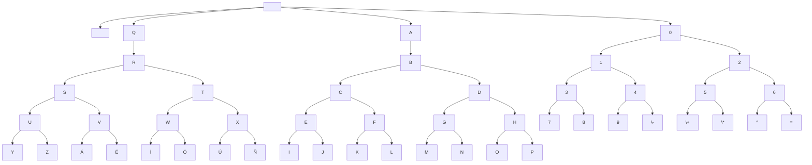

```mermaid
graph TD
    0000000[" "] --> 000000[" "]

    0000000 --> 0100000["Q"]
    0100000 --> 0100001["R"]
    0100001 --> 0100010["S"]
    0100001 --> 0100011["T"]
    0100010 --> 0100100["U"]
    0100010 --> 0100101["V"]
    0100011 --> 0100110["W"]
    0100011 --> 0100111["X"]
    0100100 --> 0101000["Y"]
    0100100 --> 0101001["Z"]
    0100101 --> 0101010["Á"]
    0100101 --> 0101011["É"]
    0100110 --> 0101100["Í"]
    0100110 --> 0101101["Ó"]
    0100111 --> 0101110["Ú"]
    0100111 --> 0101111["Ñ"]

    0000000 --> 0010000["A"]
    0010000 --> 0010001["B"]
    0010001 --> 0010010["C"]
    0010001 --> 0010011["D"]
    0010010 --> 0010100["E"]
    0010010 --> 0010101["F"]
    0010011 --> 0010110["G"]
    0010011 --> 0010111["H"]
    0010100 --> 0011000["I"]
    0010100 --> 0011001["J"]
    0010101 --> 0011010["K"]
    0010101 --> 0011011["L"]
    0010110 --> 0011100["M"]
    0010110 --> 0011101["N"]
    0010111 --> 0011110["O"]
    0010111 --> 0011111["P"]

    0000000 --> 0000001["0"]
    0000001 --> 0000010["1"]
    0000001 --> 0000011["2"]
    0000010 --> 0000100["3"]
    0000010 --> 0000101["4"]
    0000011 --> 0000110["5"]
    0000011 --> 0000111["6"]
    0000100 --> 0001000["7"]
    0000100 --> 0001001["8"]
    0000101 --> 0001010["9"]
    0000101 --> 0001011["\-"]
    0000110 --> 0001100["\+"]
    0000110 --> 0001101["\*"]
    0000111 --> 0001110["^"]
    0000111 --> 0001111["="]
```
