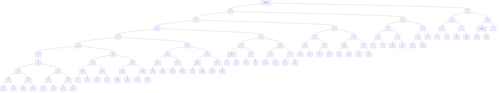

# Arbol semantico

```mermaid
graph TD
    0000000[" "]

    0000000 --> 0000001["0"]
    0010000 --> 0000000["A"]
    0100000 --> 0010000["Q"]
    0110000 --> 0100000["a"]
    1000000 --> 0110000["q"]
    1010000 --> 1000000["("]
    1100000["ARBOL"] --> 1010000[")"]

    1100000 --> 1100001["&#93"]
    1100001 --> 1100010["}"]
    1100001 --> 1100011["\\"]
    1100010 --> 1100100["\>"]
    1100010 --> 1100101["."]
    1100011 --> 1100110["CLB+0"]
    1100011 --> 1100111["~"]
    1100100 --> 1101000[":"]
    1100100 --> 1101001["&quot"]
    1100101 --> 1101010["$"]
    1100101 --> 1101011["@"]
    1100110 --> 1101100["ö"]
    1100110 --> 1101101["d"]

    1010000 --> 1010001["["]
    1010001 --> 1010010["{"]
    1010001 --> 1010011["/"]
    1010010 --> 1010100["<"]
    1010010 --> 1010101[","]
    1010011 --> 1010110["_"]
    1010011 --> 1010111["\'"]
    1010100 --> 1011000[";"]
    1010100 --> 1011001["'"]
    1010101 --> 1011010["&"]
    1010101 --> 1011011["\#"]
    1010110 --> 1011100["Ö"]
    1010110 --> 1011101["%"]

    1000000 --> 1000001["r"]
    1000001 --> 1000010["s"]
    1000001 --> 1000011["t"]
    1000010 --> 1000100["u"]
    1000010 --> 1000101["v"]
    1000011 --> 1000110["w"]
    1000011 --> 1000111["x"]
    1000100 --> 1001000["y"]
    1000100 --> 1001001["z"]
    1000101 --> 1001010["á"]
    1000101 --> 1001011["é"]
    1000110 --> 1001100["í"]
    1000110 --> 1001101["ó"]
    1000111 --> 1001110["ú"]
    1000111 --> 1001111["ñ"]

    0110000 --> 0110001["b"]
    0110001 --> 0110010["c"]
    0110001 --> 0110011["d"]
    0110010 --> 0110100["CLB-1"]
    0110010 --> 0110101["f"]
    0110011 --> 0110110["g"]
    0110011 --> 0110111["h"]
    0110100 --> 0111000["i"]
    0110100 --> 0111001["j"]
    0110101 --> 0111010["k"]
    0110101 --> 0111011["l"]
    0110110 --> 0111100["m"]
    0110110 --> 0111101["n"]
    0110111 --> 0111110["o"]
    0110111 --> 0111111["p"]

    0100000 --> 0100001["R"]
    0100001 --> 0100010["S"]
    0100001 --> 0100011["T"]
    0100010 --> 0100100["U"]
    0100010 --> 0100101["V"]
    0100011 --> 0100110["W"]
    0100011 --> 0100111["X"]
    0100100 --> 0101000["Y"]
    0100100 --> 0101001["Z"]
    0100101 --> 0101010["Á"]
    0100101 --> 0101011["É"]
    0100110 --> 0101100["Í"]
    0100110 --> 0101101["Ó"]
    0100111 --> 0101110["Ú"]
    0100111 --> 0101111["Ñ"]

    0010000 --> 0010001["B"]
    0010001 --> 0010010["C"]
    0010001 --> 0010011["D"]
    0010010 --> 0010100["E"]
    0010010 --> 0010101["F"]
    0010011 --> 0010110["G"]
    0010011 --> 0010111["H"]
    0010100 --> 0011000["I"]
    0010100 --> 0011001["J"]
    0010101 --> 0011010["K"]
    0010101 --> 0011011["L"]
    0010110 --> 0011100["M"]
    0010110 --> 0011101["N"]
    0010111 --> 0011110["O"]
    0010111 --> 0011111["P"]

    0000001 --> 0000010["1"]
    0000001 --> 0000011["2"]
    0000010 --> 0000100["3"]
    0000010 --> 0000101["4"]
    0000011 --> 0000110["5"]
    0000011 --> 0000111["6"]
    0000100 --> 0001000["7"]
    0000100 --> 0001001["8"]
    0000101 --> 0001010["9"]
    0000101 --> 0001011["\-"]
    0000110 --> 0001100["\+"]
    0000110 --> 0001101["\*"]
    0000111 --> 0001110["^"]
    0000111 --> 0001111["="]
```
